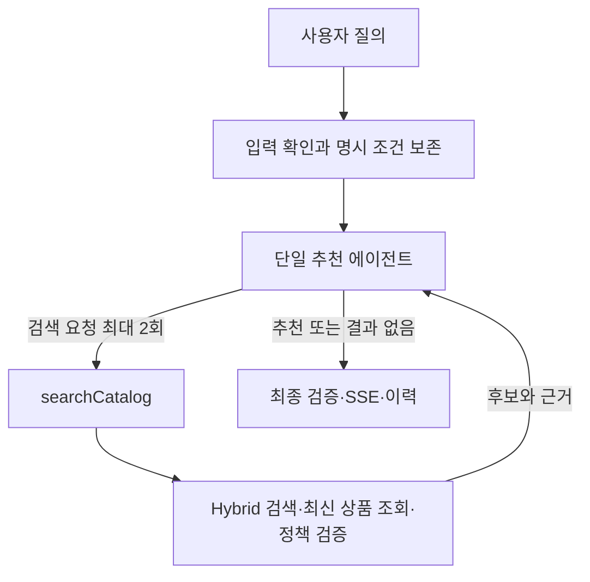

# Agentic RAG 1차 구현 계획

상태: **승인된 목표 설계 / 런타임 미구현**. 현재 동작은 [RECOMMENDATION_PIPELINE](RECOMMENDATION_PIPELINE.md)이 설명합니다. [#173](https://github.com/syann97/AgentCart/issues/173)은 이 계획을 문서에 정합하게 반영하는 선행 작업입니다.

## 목표와 규모

개인 프로젝트에서 기존 상품·검색·검증 코드를 재사용해 **단일 추천 에이전트 + 읽기 전용 검색 도구 1개 + 최대 1회 재검색**을 구현합니다. 첫 지원 범위는 [합성 상품 500개와 10개 시나리오](RECOMMENDATION_SCENARIOS.md)입니다.

모델은 검색어, 재검색 여부, 최종 후보와 설명을 결정합니다. 애플리케이션은 입력·회원 문맥·명시 조건·실행 상한·응답 검증을 관리합니다. 별도의 Planner/Evaluator 모델, 상세 조회 도구, 대화 장기 기억, 외부 검색은 1차 범위에 포함하지 않습니다.

## 흐름

정상 흐름은 첫 모델 호출에서 검색 인자를 만들고, 검색 결과를 받은 두 번째 호출에서 최종 응답을 생성합니다. 두 번째 호출이 재검색을 선택하면 검색 결과를 받은 세 번째 호출에서 종료합니다. 별도의 추천 이유 생성 호출을 추가하지 않습니다.

이는 모델에 도구 결과를 전달하고 다음 응답 또는 도구 호출을 받는 방식입니다. [OpenAI Function Calling](https://developers.openai.com/api/docs/guides/function-calling), [Spring AI Tool Calling](https://docs.spring.io/spring-ai/reference/api/tools.html). 의존성 기준은 Spring AI `2.0.1`이며 실제 도구 연동은 후속 `searchCatalog`·에이전트 구현에서 확정합니다.

## 명시 조건과 사용자 의도

- 원본 질의는 전체 요청 동안 유지합니다. 모델이 만든 검색어가 사용자 원문을 대체하지 않습니다.
- 가격의 초기 지원 표현은 원/KRW 기준 상한·하한·범위입니다. 예: `5만원 이하`, `3만원 이상`, `3만~5만원`, `50,000원 이하`. 경계 포함 여부와 범위 역전은 테스트로 고정합니다.
- 명시 카테고리는 현재 분류 목록과 정해진 별칭으로 판별합니다. 조건에는 값과 원문 근거, `EXPLICIT`/`INFERRED` 출처를 남깁니다.
- 모델이 추론한 카테고리는 검색을 돕는 soft constraint입니다. 재검색 때만 조정·제거할 수 있습니다.
- 필수 조건을 확실하게 해석하지 못하거나 서로 충돌하면 조건을 없애지 않고 입력을 구체화하도록 안내합니다.
- 사용자가 원하는 상품 종류·용도·제외 조건도 원문으로 모델에 유지합니다. 임의의 자연어 의미를 규칙 파서만으로 완전히 검증한다고 가정하지 않으며 지원 범위와 평가 사례를 명시합니다.

서버는 가격·명시 카테고리, 상품 존재·ACTIVE·양수 재고, 기존 최근 7일 주문 제외 정책을 적용합니다. 회원 식별자와 확정된 조건은 모델이 수정할 수 없는 요청 문맥에서 도구로 전달합니다.

## 검색 도구 계약 — 구현 예정

도구명은 `searchCatalog` 하나입니다.

| 구분 | 내용 |
|---|---|
| 모델 입력 | 키워드 검색어, 자연어 의미 검색어, 추론 카테고리 |
| 서버 문맥 | 회원 ID, 확정된 조건, 요청 ID, 실행 횟수와 deadline |
| 실행 | 기존 FULLTEXT + pgvector 검색, 최신 MySQL 상품 조회, 정책 검증 |
| 출력 | 최대 10개 후보의 ID·상품 정보·근거 참조·검색 지표와 빈 결과 사유 |
| 허용 행동 | 상품 검색과 조회만 수행 |

첫 의미 검색은 원본 자연어 질의를 기준으로 합니다. 재검색은 목적을 유지한 자연어 재표현을 허용합니다. 단순 키워드 나열과 의미 검색어를 구분합니다.

가능한 명시 조건을 후보 제한 전에 적용하고 결과를 반환할 때 다시 검증합니다. 현재 데이터 규모에서는 MySQL의 허용 상품 ID를 검색에 전달하는 방식을 우선 검토합니다.

검색 점수는 순위 지표입니다. 정규화 점수를 신뢰도나 충분성 판단의 유일한 기준으로 사용하지 않습니다. 임베딩 모델·차원·상품 텍스트 구성을 맞추고, 조회된 상품 근거는 최신 MySQL 데이터를 기준으로 합니다.

## 재검색과 종료

- 첫 결과가 원래 용도와 관련 있고 필수 조건을 만족하면 1~5개만 추천하고 종료합니다.
- 후보가 5개 미만이라는 이유만으로 재검색하지 않습니다.
- 관련성이 부족하면 검색어를 구체화하거나 추론 카테고리를 조정해 한 번 더 검색합니다. 같은 인자를 반복하지 않습니다.
- 재검색 이후에도 근거가 없으면 결과 없음으로 종료합니다. 무관한 상품으로 개수를 채우지 않습니다.
- 카탈로그 밖 질의는 지원 범위를 안내합니다. 검색 결과 없음과 서비스 오류는 서로 다른 상태로 응답합니다.

## 실행 상한 — 목표 값

| 항목 | 목표 |
|---|---|
| Chat 모델 | 현재 사용 모델 `gpt-4o-mini` 유지 |
| Embedding | 현재 Ollama `bge-m3` 유지 |
| 에이전트 / 노출 도구 | 1개 / `searchCatalog` 1개 |
| 검색 실행 | 요청당 최대 2회, fallback 검색도 이 상한에 포함 |
| LLM 호출 | 정상 2회, 재검색 시 최대 3회; 자동 재시도도 횟수에 포함 |
| 모델에 전달할 후보 | 검색당 최대 10개 |
| 최종 추천 | 최대 5개, 0개 허용 |
| 전체 처리 제한 | 초기 30초, 개별 호출도 남은 시간 이내 |

상한은 프롬프트 지시만으로 관리하지 않고 실행 코드가 강제합니다. 마지막 모델 호출은 추가 검색을 허용하지 않습니다. 연결 종료·시간 초과 시 작업을 취소하고 추가 호출을 시작하지 않습니다.

LLM·구조화 응답 실패 시 추가 모델 재시도로 상한을 늘리지 않습니다. 필수 조건을 확인할 수 있고 시간이 남으면 일반 키워드 검색으로 fallback하고 그 모드를 표시합니다. deadline 이후에는 이미 검증된 결과만 사용하거나 오류로 종료합니다. 해석 불가능한 조건을 삭제해서 결과를 만들지 않습니다.

## 응답과 근거 — 구현 예정

- 모델은 제공된 후보 ID와 상품 근거만 사용해 전체 추천 이유를 한 번에 작성합니다.
- 상품 ID·상품명·가격과 검증 가능한 조건은 서버 데이터로 구성합니다.
- 후보 밖 ID, 존재하지 않는 근거 참조, 잘못된 응답 형식은 서버에서 거부합니다.
- 자유로운 추천 문장의 의미 정확성은 작은 평가셋으로 검증합니다. 근거 ID 검사만으로 설명의 모든 사실이 검증되었다고 판단하지 않습니다.

기존 `RecommendationResult`를 필요한 범위에서 확장하며 별도의 근거 검증 LLM은 추가하지 않습니다.

## SSE 계약 — 구현 예정

| type | 의미 |
|---|---|
| `status` | 검색 중·재검색 중 등 간단한 진행 상태 |
| `result` | 검증된 상품 결과 한 개 |
| `done` | 정상 종료; 추천·결과 없음·일반 검색 fallback·입력 구체화 안내의 outcome 구분 |
| `error` | 처리 실패로 인한 종료 |

연결이 살아 있는 요청은 `done` 또는 `error` 중 하나로 한 번만 종료합니다. 그 이후에는 이벤트를 전송하지 않습니다. 결과 0개도 `done`으로 종료합니다. 연결이 이미 끊어진 경우 전송 보장 대신 취소 처리를 검증합니다.

Backend와 Frontend 계약을 같은 변경에서 갱신합니다. 현재 `complete` 타입을 이 목표 계약과 혼용하지 않습니다. 인증 전 HTTP 오류와 연결 후 이벤트 오류도 구분합니다.

기존 Kafka 이력은 전송한 상품 결과에 대해서만 사용합니다. 진행 상태와 결과 없음은 상품 추천 이력으로 만들지 않습니다. 로그에는 요청 ID, 검색 시도, 선택한 행동 코드, 결과 수, 소요 시간과 호출 수를 남깁니다.

## 평가와 완료 기준

[추천 시나리오](RECOMMENDATION_SCENARIOS.md)의 약 20개 평가 질의와 고정된 데이터 스냅샷으로 시작합니다. 예상 정답 상품은 수동 검토하며 FULLTEXT 매칭 수를 정답 개수로 취급하지 않습니다.

- 평가셋에서 명시 가격·카테고리·재고 규칙 위반 0건
- 첫 검색으로 종료하는 사례와 검색어 변경 후 적합한 결과를 찾는 사례 재현
- 미지원 질의·근거 없는 추천의 결과 없음 처리
- 호출 횟수·시간 상한과 연결 종료 후 취소 검증
- 잘못된 응답과 LLM 장애에서 조건 보존 및 종료 상태 검증
- 동일한 평가셋에서 기존 파이프라인과 Hit@5 비교; 기준선 대비 품질 저하 여부 기록

일반 테스트는 외부 LLM을 mock합니다. 실제 모델 평가는 별도 실행하며 모델·데이터·프롬프트 버전, 토큰 사용과 지연시간을 기록합니다. 기존 회귀 검증은 유지하되, 변경된 정책과 충돌하는 기대값은 수정합니다.

## 작업 순서와 상태

| 단계 | 범위 | 상태 |
|---|---|---|
| 1. #173 | 문서·skills·prompts 정합성, 현재/목표 구분, 공통 지침과 참조 검사 | 이번 문서 작업 |
| 2. 기반 코드 | 명시 조건 보존, 구조화 계약, 검색·데이터 정책, 안정 버전 호환성 확인 | 후속 구현 |
| 3. 에이전트 | 검색 도구와 제한된 반복, 통합 이유 생성 | 후속 구현 |
| 4. 응답·평가 | SSE 진행·종료·취소, 회귀 테스트와 실제 모델 평가 | 후속 구현 |

문서 정비에서는 런타임 코드·의존성·데이터를 변경하지 않습니다. 구현한 단계는 해당 변경에서 [현재 파이프라인](RECOMMENDATION_PIPELINE.md)과 이 상태표를 함께 갱신합니다.
